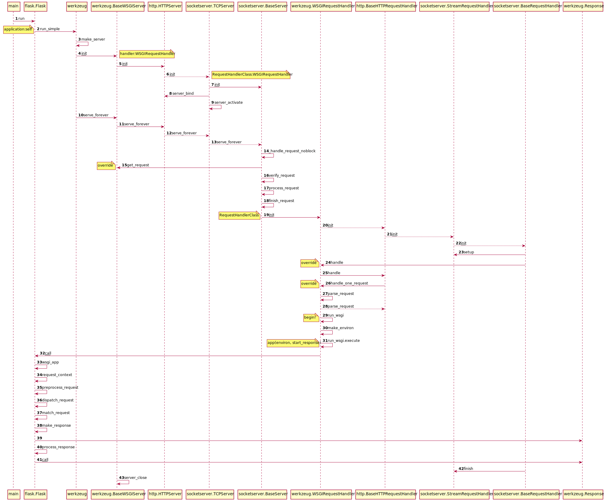

# Flask 源码分析(一) - app调用流程

Flask.run -> werkzeug.run_simple -> werkzeug.make_server -> serve_forever

过程中涉及的类关系如下:

- werkzeug.BaseWSGIServer < http.HTTPServer < socketserver.TCPServer < socketserver.BaseServer
- werkzeug.WSGIRequestHandler < http.BaseHTTPRequestHandler < socketserver.StreamRequestHandler < socketserver.BaseRequestHandler

详细调用序列图

